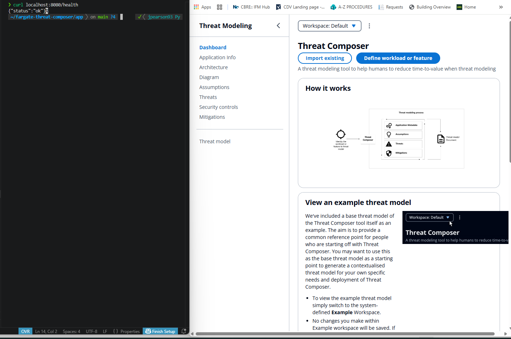

# Threat Composer — AWS ECS Fargate Infrastructure

Production-grade containerised application deployed on AWS using ECS Fargate, provisioned end to end with Terraform following infrastructure as code best practices and GitHub Actions CI/CD (OIDC).


## Architecture Overview

> Architecture diagram coming soon

**Traffic Flow:**

```
Internet → Route53 (tm.joepearson.dev) → ALB (public subnets) → ECS Fargate Tasks (private subnets) → NAT Gateway (outbound only)
```

**Key design decisions:**

- ECS tasks run in private subnets, not directly accessible from the internet
- All inbound traffic routes through the Application Load Balancer
- NAT Gateway handles outbound traffic from private subnets
- HTTPS enforced via ACM certificate with HTTP redirecting to HTTPS
- Container runs on port 8080, ALB handles SSL termination
- IAM roles follow least privilege principle throughout
- Terraform state managed remotely via S3 with native state locking

---

## Infrastructure Components

| Component | Details |
|---|---|
| VPC | Custom VPC with public and private subnets across 2 availability zones |
| Public Subnets | 2 public subnets hosting the ALB and NAT Gateway |
| Private Subnets | 2 private subnets hosting ECS Fargate tasks |
| Internet Gateway | Public internet access for the ALB |
| NAT Gateway | Outbound internet access for ECS tasks in private subnets |
| ALB | Application Load Balancer with HTTP to HTTPS redirect |
| ACM | SSL certificate for HTTPS with Route53 DNS validation |
| ECS Fargate | Containerised app running on serverless compute |
| ECR | Docker image repository |
| IAM | ECS task execution role and task service role with least privilege |
| CloudWatch | Container log groups and log streaming for observability |
| Route53 | DNS management and ACM certificate validation |
| S3 | Terraform remote state storage with native state locking |

---

## Local Setup

### Prerequistes
- Docker installed
- Git installed

``` bash
cd app

# build
docker build -t fargate-threat-composer .

# run 
docker run -d --name fargate-threat-composer -p 8080:8080 fargate-threat-composer:latest      

# verify
url http://localhost:8080/health   
```
The Threat Composer UI will be available at http://localhost:8080

## Local Docker Health Check

The container exposes a health endpoint to validate application availability before deployment to ECS/Fargate.

```bash
docker ps
```

```bash
CONTAINER ID   IMAGE                     STATUS
12ab34cd56ef   threat-composer:latest   Up 2 minutes (healthy)
```

```bash
curl http://localhost:8080/health
```

```json
{
  "status": "ok"
}
```



## How To Deploy
Documentation: [Deployment Guide](docs/deployment.md) (bootstrap, CI/CD and Teardown)


## Terraform Structure

```
.
├── backend.tf
├── main.tf
├── variables.tf
├── outputs.tf
├── provider.tf
├── terraform.tfvars
├── bootstrap/
│   ├── main.tf
│   ├── variables.tf
│   ├── outputs.tf
│   └── terraform.tfvars
└── modules/
    ├── vpc/
    │   ├── main.tf
    │   ├── variables.tf
    │   └── outputs.tf
    ├── security-groups/
    │   ├── main.tf
    │   ├── variables.tf
    │   └── outputs.tf
    ├── alb/
    │   ├── main.tf
    │   ├── variables.tf
    │   └── outputs.tf
    ├── acm/
    │   ├── main.tf
    │   ├── variables.tf
    │   └── outputs.tf
    ├── iam/
    │   ├── main.tf
    │   ├── variables.tf
    │   └── outputs.tf
    ├── ecr/
    │   ├── main.tf
    │   ├── variables.tf
    │   └── outputs.tf
    └── ecs/
        ├── main.tf
        ├── variables.tf
        └── outputs.tf
```

Each module is self contained with its own `main.tf`, `variables.tf` and `outputs.tf`. Modules communicate through outputs and variables following the DRY principle.

---

## Networking Design

**CIDR Blocks:**

| Subnet | CIDR | AZ |
|---|---|---|
| VPC | 10.0.0.0/22 | |
| Public Subnet 1 | 10.0.0.0/24 | eu-west-2a |
| Public Subnet 2 | 10.0.1.0/24 | eu-west-2b |
| Private Subnet 1 | 10.0.2.0/24 | eu-west-2a |
| Private Subnet 2 | 10.0.3.0/24 | eu-west-2b |

**Security Groups:**

| Security Group | Inbound | Outbound |
|---|---|---|
| ALB SG | 80 from 0.0.0.0/0, 443 from 0.0.0.0/0 | All |
| ECS Task SG | 8080 from ALB SG only | All |

---

## Security

- ECS tasks run in private subnets with no public IP assigned
- IAM least privilege roles scoped to only required permissions
- OIDC authentication in CI/CD pipeline eliminates long-lived AWS credentials
- Non-root container user reduces blast radius if container is compromised
- Multi-stage Docker build minimises attack surface and image size
- HTTPS enforced across all traffic, HTTP redirects to HTTPS
- Security groups restrict ECS task access to ALB only

---

## Future Improvements

- Interface Endpoints for AWS services to reduce NAT Gateway data transfer costs by keeping AWS-to-AWS traffic on the private network
- Gateway Endpoint for S3 (free), routes S3 traffic privately without going through the NAT Gateway
- Auto scaling for ECS tasks based on CPU and memory metrics
- WAF on the ALB for additional security
- Multi environment setup (dev, staging, prod) using Terraform workspaces
- Shift left security with Checkov in pre-commit hooks locally

---